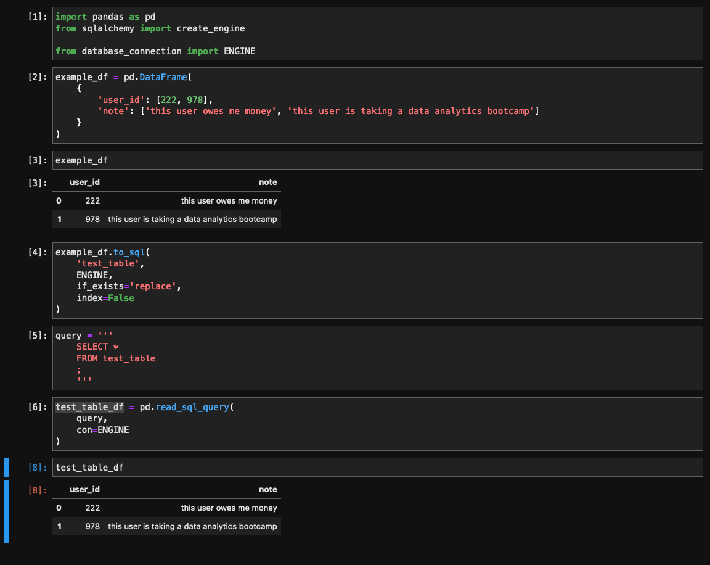
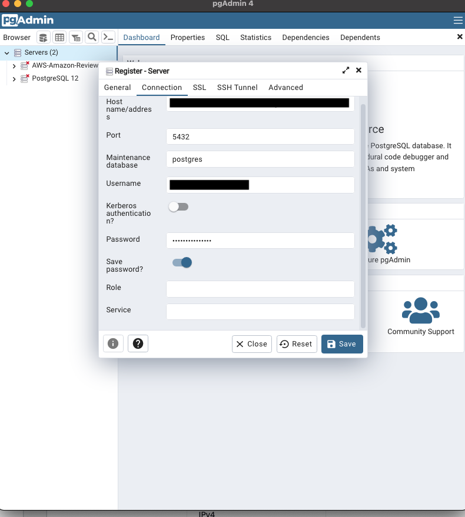

# Setup

## Connecting to the PostgreSQL Database

**ensure `config.py` is in your `.gitignore` before continuing**

### To connect to the `brew-outdoor-db` using python: 

- visit the LastPass invite from Tim
- pull the `config_example.py`, 
  - copy the file, change the filename to `config.py` 
  - change `HOST` to the URL value in LastPass
  - change `DB_USERNAME` to the Username value in LastPass
  - change `DB_PASSWORD` to the Site password value in LastPass
- in your Jupyter Notebook and / or python files, use `from database_connection import ENGINE` 
- use `ENGINE` in your `pandas`-related arguments; examples below


**Add a DataFrame to existing table using [pandas.DataFrame.to_sql()](https://pandas.pydata.org/docs/reference/api/pandas.DataFrame.to_sql.html):**

```
df.to_sql(
    table_name,
    ENGINE,
    if_exists='argument',
    index=False
)
```

**Read a table to a DataFrame using [pandas.read_sql_query](https://pandas.pydata.org/docs/reference/api/pandas.read_sql_query.html):**

```
query = '''
    SELECT *
    FROM test_table
    ;
    '''

test_table_df = pd.read_sql_query(
    query, 
    con=ENGINE
)
```





### Connect using PGAdmin

- visit the LastPass invite from Tim
- in PGAdmin, create a new server
- input corresponding credentials
- CREATE tables
- profit?


